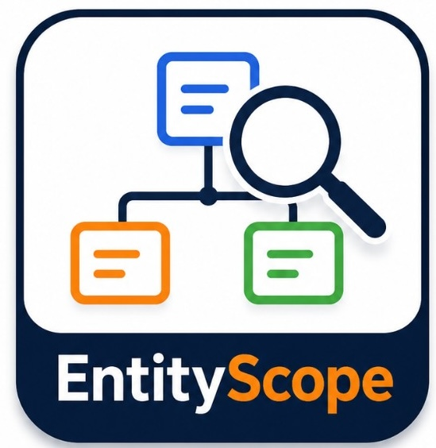

<p align="center">
  
</p>

<p align="center">
  <strong>EntityScope</strong> — explore JPA and Hibernate XML domain models as an interactive graph.<br />
  Published for <strong>VS Code Marketplace</strong> and <strong>Open VSX</strong> (Cursor and compatible editors).
</p>

<p align="center">
  
</p>

EntityScope scans Java projects, discovers entities and their relationships, and renders an interactive graph for domain exploration — not UML generation.

## Install

| Platform | Where to get it |
|----------|-----------------|
| **VS Code** | [Visual Studio Marketplace](https://marketplace.visualstudio.com/) — search **EntityScope** |
| **Cursor & Open VSX editors** | [Open VSX Registry](https://open-vsx.org/) — search **EntityScope** |

After install, look for the **EntityScope** icon in the Activity Bar (entity diagram with magnifying glass).

## Branding

Official colors used in the logo and UI accents:

| Color | Usage |
|-------|--------|
| Navy `#1e3a5f` | Primary text, connections, magnifying glass |
| Blue `#3b82f6` | Package / entity accents |
| Orange `#f97316` | **Scope** highlight, secondary accents |
| Green `#22c55e` | Relationship accents |

Full branding sheet: [`media/entityscope-branding.png`](media/entityscope-branding.png)

## Features

- **JPA entity discovery** — scans `@Entity` classes with relationship annotations
- **Hibernate XML mapping** — scans `*.hbm.xml` for legacy Hibernate 3.x mappings
- **Interactive graph** — React Flow + ELK automatic layout
- **Package navigation** — sidebar tree, collapse, and filter by package
- **Relationship legend** — color-coded edge types with cardinality (hover to expand)
- **Search** — filter by entity name or table name
- **Details panel** — properties, relations, and metadata (on demand)
- **Source navigation** — open entity mapping from the graph or context menu

## How to open the graph

| Entry point | Action |
|-------------|--------|
| **Activity Bar** | EntityScope icon → **Open Graph** or click an entity |
| **Command Palette** (`Ctrl+Shift+P` / `Cmd+Shift+P`) | `EntityScope: Open Domain Model` |
| **Explorer / editor** | Right-click a `.java` or `.hbm.xml` file |

## Commands

| Command | Description |
|---------|-------------|
| `EntityScope: Open Domain Model` | Scan workspace and open the graph |
| `EntityScope: Refresh Model` | Re-scan entities (sidebar + open graph) |
| `EntityScope: Select Current Entity` | Open graph and select the entity in the active editor |

> Command IDs remain `entityViewer.*` internally for compatibility; titles show **EntityScope** in the palette.

## Supported JPA annotations

- Entity: `@Entity`, `@Table`, `@Id`, `@EmbeddedId`, `@Embeddable`, `@MappedSuperclass`
- Relations: `@OneToOne`, `@OneToMany`, `@ManyToOne`, `@ManyToMany`
- Metadata: `cascade`, `fetch`, `orphanRemoval`, `mappedBy`

## Supported Hibernate XML

- Elements: `class`, `id`, `property`, `many-to-one`, `one-to-many`, `many-to-many`, `one-to-one`
- Collections: `set`, `list`, `bag` with `one-to-many` / `many-to-many` or `element` (primitive collections)
- Fully qualified class names on `<class name="com.example.Entity">`

## Development

### Prerequisites

- Node.js 18+
- VS Code or Cursor 1.85+

### Install & build

```bash
npm run install:all
npm run build
```

Press `F5` to launch the Extension Development Host with a sample project.

### Sample projects

| Path | Description |
|------|-------------|
| `sample-projects/jpa-sample/` | JPA annotations (7 entities) |
| `sample-projects/hibernate-xml-sample/` | Hibernate XML (9 entities) |

```bash
npm run validate:hibernate-sample
```

## Architecture

```
Java / HBM Project → ModelScanner → DomainModel → JSON → React WebView
```

## Publishing assets

| File | Purpose |
|------|---------|
| `media/icon.png` | Marketplace / Open VSX extension icon (128×128) |
| `media/icon-256.png` | High-resolution listing asset |
| `media/entity-scope.svg` | Activity Bar icon |
| `media/entityscope-branding.png` | Full branding reference |

## License

[Apache-2.0](https://github.com/erikchaupis/entityscope/blob/main/LICENSE)
